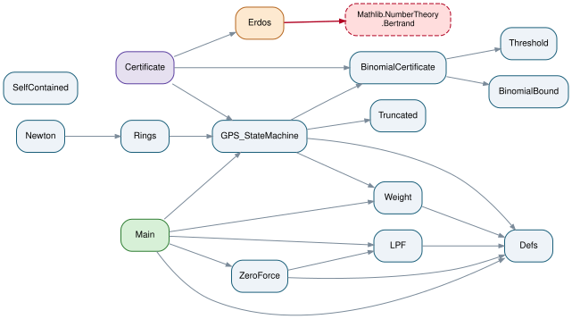

# StructuralSieve — Lean 4 formalization

Machine-checked formalization accompanying the paper
**"The Structural Sieve"** (A. Flamandzki).

**Status: fully verified — zero `sorry`, no extra axioms beyond Mathlib.**
The entire chain, from the definition of the complete generative base (Def. 2.1)
to `bertrand_chebyshev`, is machine-checked. Two headline results are exact
structural equivalences, not existence bounds: `StructuralSieve.prime_iff_uncovered_by_prev`
(window `(P_k, 2·P_k]`) and its generalization
`StructuralSieve.void_iff_prime_in_deterministic_zone` (the full deterministic
zone `(P_k, P_k²)`, with the reach shown exact by `determinism_breaks_above`).
`StructuralSieve.bertrand_chebyshev` is a **corollary** of the first — see
*Origin of the result* below for why. The main theorem does **not** use
Mathlib's proof of Bertrand's postulate (`Nat.bertrand` /
`Nat.exists_prime_lt_and_le_two_mul`), and its import closure does **not** contain
`Mathlib.NumberTheory.Bertrand` at all: the quantitative atom is closed by a
self-contained binomial certificate (`binomial_contradiction`). See
*Non-circularity* below.

## Origin of the result

The starting observation is **not** Bertrand's. Bertrand (1845) conjectured, from
tables, that every window `(n, 2n]` contains a prime — an *existence* question.
This project started from a different question about the same window: **is every
composite in `(P_k, 2·P_k]` already covered by a prime strictly below `P_k` (or by
`2`)?** — i.e. does the window need any prime factor from *outside* itself? That
question, not Bertrand's, is what the development answers first, and it answers it
with an exact equivalence rather than an existence bound:

> `StructuralSieve.prime_iff_uncovered_by_prev` — for `n ∈ (P_k, 2·P_k]`: `n` is
> prime **iff** `n` is not covered by the base of primes below `P_k`.

This is proved from pure divisibility: `ZeroForce.lean`'s Zero Effective Force
lemma shows the only multiple of `P_k` in its own window is `2·P_k`, already
covered by `2`, so `P_k` contributes zero new coverage to its own window; combined
with the least-prime-factor bound (`LPF.lean`), this gives the equivalence with no
appeal to counting or to the central binomial coefficient.

**Generalization.** The same equivalence holds throughout the base's full
deterministic reach, the zone `(P_k, P_k²)`, not only in the narrower window
`(P_k, 2·P_k]`:

> `StructuralSieve.void_iff_prime_in_deterministic_zone` — for `n` in
> `(P_k, P_k²)`: `n` is a void of the base of primes below `P_k` **iff** `n` is
> prime.

`Rings.lean`'s `determinism_breaks_above` shows this reach is exact: the
equivalence genuinely fails once `n ≥ P_k²` (it exhibits a composite void, `q²`,
at the square of the anchor, for `q` the least prime above `P_k`). So the
deterministic reach of a prime base is `P_k²`; the window `(P_k, 2·P_k]` is simply
the initial segment of this zone in which, in addition, a second and independent
property holds — self-containment (below).

**Self-containment — a separate, elementary fact, not to be conflated with the
equivalence above.** Inside `(P_max, 2·P_max]` every composite is fully
*buildable* from the base: all of its prime factors lie in `{2, …, P_max}`
(`window_composite_smooth`, `Rings.lean`) — a purely elementary case-split on
divisibility, independent of the LPF machinery behind `prime_iff_uncovered_by_prev`
and not used by it. Just beyond `2·P_max` this buildability breaks: the first
composite requiring a prime *outside* the base appears (`2·nextprime(P_max)`).
`SelfContained.lean`'s `window_self_contained_bound`/`max_self_contained_width`
derive the window's width `2·P_max` from this buildability boundary alone — a fact
about the window's *size* (the container), not about whether it contains a prime
(the content). It fixes *why* the width is `2·P_max` rather than something else,
but plays no role in, and is not needed by, the void/prime equivalence above; it
does feed the off-path binomial-coefficient route in §2 below (the S1 purity law
uses the same buildability boundary). The object is thus a single locked triple
**(base, window, width)** in which `P_max` is at once the largest element of the
base, the start of the window, and the window's width; the base is the complete
run of consecutive primes up to `P_max` (no prime missing), and base and window
co-scale with `P_max` rather than being independent parameters.

**Bertrand's postulate is a corollary.** Given `prime_iff_uncovered_by_prev`,
existence of a prime in the window follows once the window is shown not to be
*entirely* covered — the whole postulate reduces to one localized quantitative
atom: *the sieve of the base never covers its own window completely*. This is
where the quantitative closure (the central binomial coefficient, §2–3 below)
enters — the same object Erdős used for his own, differently-motivated 1932 proof
of the same postulate. Bertrand asked "is there a prime here?"; this project asked
"where does deterministic certainty about primality end, and how far does it
reach?" — different questions, proved by different means, that happen to agree on
this object. The governing quantity of the corollary's closure is the **local
insufficiency of the full base** over its own window `(P_max, 2P_max]` — the
longest run of covered positions there; external gap functions (below) only
upper-bound it.

## What is proved, and by what means

The reduction chain (all sorry-free):

```
bertrand_chebyshev  ←  prime_in_window  ←  structural_sieve_survivor
                     ←  dense_sieve_survivor  ←  binomial_contradiction
```

### Module dependency graph



The graph (regenerate with `scripts/dependency_graph.py`, which also prints a
non-circularity audit) makes the import structure explicit. `Main` reaches the
quantitative kernel through `GPS_StateMachine → BinomialCertificate →
{BinomialBound, Threshold}` — the self-contained path. The only edge to
`Mathlib.NumberTheory.Bertrand` (red) comes from `Erdos.lean`, which is reachable
only from `Certificate.lean` (the modularity interface) and is **not** in the import
closure of `Main`. So the main theorem does not depend on Mathlib's Bertrand theorem.

Three layers, with distinct provenance:

**1. The structural reduction (independent, this project).**
This is the same reduction that yields the two headline equivalences of *Origin
of the result* above (`prime_iff_uncovered_by_prev`, `void_iff_prime_in_deterministic_zone`):
LPF bound, Zero Effective Force, structural weight `w ≥ 1`, self-containment
(*why `2·P_max`*), the sparse regime closed unconditionally by a union bound
(`Truncated.lean`), the deterministic zone `(P_k, P_k²)`, and the disjoint
minFac-fiber telescope are all exercised by `bertrand_chebyshev`'s proof term.
`Rings.lean` also proves a separate, **off-path** closure for the small anchors
`P_k ≤ 83` — a sufficient coprimality condition on the *active-covering primes*
(`p² ≤ 2P_k`) via the Jacobsthal-type gap bounds `g(30)=6`, `g(210)=10`,
`g(2310)=14` — a loose external upper bound from a smaller modulus, **not** the
object's own gap. It is kept in the repository as an alternative route, but it is
**not** invoked by the theorem's proof term: every `P_k`, small or large, is
actually closed by the small-window oracle (`n < 512`) or the central-binomial
certificate (`n ≥ 512`) described in §3. No structural closure of the existence
atom in the general window was found; the atom is closed on the central binomial
coefficient below.

(On the Jacobsthal regimes: `g(M)` is the global gap of a *fixed* modulus `M`, and
here `M` is the product of the active-covering primes `p² ≤ 2P_k` — a subset that
coincides with a smaller, foreign object, not the full base. It is not the
object's own quantity; `g(M) ≤ P_k` is only a sufficient upper proxy that happens
to close the small anchors in this off-path alternative — not in the theorem's
actual proof term.)

**2. The central binomial coefficient — an off-path alternative derivation
(`Rings.lean`/`Newton.lean`), not used by the proof term.**
`Rings.lean`/`Newton.lean` explore a second way to reach and bound the central
binomial coefficient `C(2n,n)`: `4^n = (1+1)^{2n}` is the sum of the `2n+1`
binomial coefficients of order `2n`, and its prime factorization in the window is
governed by the paper's S1 purity law: a new source `q ∈ (n, 2n]` divides
`C(2n,n)` exactly once, because its first multiple `2q` exceeds `2n`. Formally:
`window_primes_prod_dvd_centralBinom` (Rings.lean/Newton.lean), with the lower
bound `4^n ≤ (2n+1)·C(2n,n)` proved from scratch from the Pascal row
(`four_pow_le_newton`, Newton.lean). This route is original — the object is
reached from the S1 purity law, not taken from prior work, and Erdős reached the
same object in 1932 by a different route, a convergence with no exclusivity over
it — but it is **not** the derivation `binomial_contradiction` actually uses: the
proof term's two bounds on `C(2n,n)` are the ones in §3 (`BinomialBound.lean`,
`Threshold.lean`, and Mathlib's own lower bound).

**3. The quantitative certificate (self-contained, this project) — the bounds the
proof term actually uses.**
For `n ≥ 512` the two bounds on `C(2n,n)` are combined. The upper bound
(`window_centralBinom_le`, `BinomialBound.lean`) — if the window is empty, every
prime factor of `C(2n,n)` is `≤ 2n/3`, so the product is at most
`(2n)^√(2n) · 4^(2n/3)` — is reproved in-project from Legendre/Kummer and primorial
primitives, importing only `Choose.Factorization` and `Primorial`, **not**
`Mathlib.NumberTheory.Bertrand`. The prime-free size threshold
`n · (2n)^√(2n) · 4^(2n/3) ≤ 4^n` (`threshold_inequality`, `Threshold.lean`) is a
generic convexity inequality, adapted from Mathlib's analysis (not its Bertrand
file). With the lower bound `4^n < n · C(2n,n)` (`Nat.four_pow_lt_mul_centralBinom`)
they give `4^n < 4^n`, a contradiction (`binomial_contradiction`,
`BinomialCertificate.lean`). Small windows `2 < n < 512` are closed by a local
computational oracle (`small_window_oracle`), chunked into fixed-width ranges glued
by an auxiliary lemma and discharged by kernel-checked `decide` — no `native_decide`.

**Provenance statement (for referees).** The development is neither "independent
of Erdős" nor "Erdős in disguise". An independent structural reduction shows
*why* the postulate collapses to a single atom and closes entire regimes without
any counting; the atom is then closed on the central binomial coefficient `C(2n,n)`
via the two bounds reproved in-project (`BinomialBound.lean`, `Threshold.lean`; see
§3) — **not** via the S1-purity-law derivation of §2, which is a separate,
off-path characterization of the same object, also original and not taken from
prior work. So the closing certificate imports no Mathlib Bertrand theorem. Erdős reached the same object in
1932 by a different path: a convergence on one object, with historical priority of
use but no exclusivity over it. Modularity is a theorem (`Certificate.lean`,
`WindowCertificate`): the atom's closure depends only on an abstract certificate,
and two instances plug into the identical slot — `erdos_certificate` (via Mathlib's
inequalities) and the self-contained `binomial_certificate`. Any certificate of the
same strength (a Chebyshev-type estimate; or, on the active-covering modulus, a
bound `g(∏_{p²≤2P_k} p) ≤ P_k` of Iwaniec strength) closes the atom without touching
anything above it.

## Non-circularity

The main theorem `bertrand_chebyshev` closes the atom via the self-contained
`binomial_contradiction`; its import closure does **not** contain
`Mathlib.NumberTheory.Bertrand`. That file is imported only in `Erdos.lean`, which
supplies instance A (`erdos_certificate`) for the modularity comparison and sits
**off** the main path. The circularity audit is a grep over **usages**, not imports:

```sh
grep -rn "sorry" StructuralSieve                      # no matches
grep -rn "Nat.bertrand[^_]\|exists_prime_lt" StructuralSieve
# matches only in comments/documentation; never applied in a proof
```

## Trust base

The main theorem's import closure discharges its finite facts with kernel-checked
`decide` only: the small-window oracle (`small_window_oracle`, `BinomialCertificate.lean`)
is split into fixed-width chunks glued by an auxiliary lemma, specifically so that it
stays within the kernel's `decide` (not `native_decide`). (`Rings.lean`'s Jacobsthal
gap bounds — `jacobsthal_210`, `jacobsthal_2310` — are chunked the same way, but they
are the off-path alternative of §1: not part of `bertrand_chebyshev`'s import closure.)
`native_decide` (compiled
evaluation) appears exactly once in the repository, in `Erdos.lean`'s
`small_window_prime` — the off-path instance A (`erdos_certificate`) kept only for the
modularity comparison in `Certificate.lean`; it is not reachable from `Main` (see the
module dependency graph above). Auditors who reject `native_decide` outright can
therefore ignore `Erdos.lean` entirely and still have a fully `decide`-only path to
`bertrand_chebyshev`.

## Exact versions (required for reproduction)

| Component | Pin |
|---|---|
| Lean toolchain | `leanprover/lean4:v4.35.0-rc2` (file `lean-toolchain`) |
| Mathlib | tag `v4.35.0-rc2`, commit `065356127b1dc0016f66b7283ce0ce2c4055aa55` |

Transitive dependencies (from `lake-manifest.json`, manifest format `1.1.0`):

| Package | Commit |
|---|---|
| batteries | `495c008c3e3f4fb4256ff5582ddb3abf3198026f` |
| aesop | `f642a64c76df8ba9cb53dba3b919425a0c2aeaf1` |
| proofwidgets | `be3b2e63b1bbf496c478cef98b86972a37c1417d` |
| Qq | `b8f98e9087e02c8553945a2c5abf07cec8e798c3` |
| importGraph | `85b59af46828c029a9168f2f9c35119bd0721e6e` |
| LeanSearchClient | `c5d5b8fe6e5158def25cd28eb94e4141ad97c843` |
| plausible | `55c8532eb21ec9f6d565d51d96b8ca50bd1fbef3` |
| Cli | `4f10f47646cb7d5748d6f423f4a07f98f7bbcc9e` |

The pinned commits are recorded in `lake-manifest.json`; keep that file under
version control so the exact dependency graph is reproducible.

## Build

The toolchain is selected automatically by `elan` from `lean-toolchain`.

```sh
lake exe cache get      # download prebuilt Mathlib oleans for the pinned commit
lake build              # build the StructuralSieve library
```

`lake exe cache get` is essential: without it, `lake build` would attempt to
compile all of Mathlib from source. A successful `lake build` reports **no
errors, no `sorry`, and no warnings in project files** (doc-string lint notices
replayed from Mathlib's own files are expected and harmless).

## File map

| File | Content (paper reference) |
|---|---|
| `StructuralSieve/Defs.lean` | Complete generative prime base, sieve coverage, window (Def. 2.1, Prop. 2.2) |
| `StructuralSieve/LPF.lean` | Least Prime Factor bound; uncovered ⇒ prime (Lemma 3.1, Cor. 3.2) |
| `StructuralSieve/ZeroForce.lean` | Zero Effective Force; composites covered by preceding base; **`prime_iff_uncovered_by_prev`** — headline equivalence (Lemma 4.1, Cor. 4.2) |
| `StructuralSieve/Weight.lean` | Structural weight `w ≥ 1`; expansion capacity `M' < P·φ(M')` (Lemma 4.3, Cor. 4.5) |
| `StructuralSieve/SelfContained.lean` | Self-containment fixes the window width (*why `2` / why `P_min`*) |
| `StructuralSieve/Truncated.lean` | Sparse-regime positivity by union bound, unconditional |
| `StructuralSieve/Rings.lean` | Ring collective: void/coverage dichotomy; **`void_iff_prime_in_deterministic_zone`** — headline equivalence generalized to the full zone `(P_k, P_k²)`, with **`determinism_breaks_above`** proving the reach exact; minFac telescope, interference (Legendre) identity, generalized family `(P_max, P_min·P_max]`; also the **off-path** small-anchor closures `P_k ≤ 83` (§1) and the S1 bridge to `C(2n,n)` (§2, which reuses the self-containment fact `window_composite_smooth`), neither used by `bertrand_chebyshev`'s proof term |
| `StructuralSieve/Newton.lean` | **Off-path** (§2): a second, unused derivation of the central binomial coefficient's window content — S1 divisibility, lower bound `4^n ≤ (2n+1)·C(2n,n)` from the Pascal row, empty window ⇒ old sources only |
| `StructuralSieve/BinomialBound.lean` | Upper bound `window_centralBinom_le`, reproved from Legendre/Kummer + primorial primitives (no Bertrand import) |
| `StructuralSieve/Threshold.lean` | Prime-free size inequality `threshold_inequality` (real convexity; adapted from Mathlib's analysis, not its Bertrand file) |
| `StructuralSieve/BinomialCertificate.lean` | **Self-contained kernel**: `binomial_contradiction` — two bounds on `C(2n,n)` + local chunked, kernel-checked `decide` oracle (`small_window_oracle`, no `native_decide`); imports no `Mathlib.NumberTheory.Bertrand` |
| `StructuralSieve/GPS_StateMachine.lean` | Generative window; regime dispatch; `dense_sieve_survivor` (routes to `binomial_contradiction`); `prime_in_window` |
| `StructuralSieve/Certificate.lean` | Modular interface `WindowCertificate`; instances `erdos_certificate` (via Mathlib) and `binomial_certificate` (self-contained) |
| `StructuralSieve/Erdos.lean` | Instance A (off the main path): `erdos_contradiction` via Mathlib's two `C(2n,n)` inequalities — kept only for the modularity comparison |
| `StructuralSieve/Main.lean` | Theorem 5.1 and `bertrand_chebyshev` |

## License

This repository is licensed under the **Apache License, Version 2.0** — see
[`LICENSE`](LICENSE). The project depends on and adapts Mathlib (Apache-2.0), so its
licensing is Apache-2.0-compatible throughout. In particular `StructuralSieve/Threshold.lean` adapts a prime-free
size inequality from Mathlib (authors Patrick Stevens and Bolton Bailey); the attribution is
recorded in [`NOTICE`](NOTICE). All other files are original to this development and depend on
Mathlib only as a library.

## Citation

Cite the accompanying paper (see [`CITATION.cff`](CITATION.cff)). The formalization makes
the logical status of the result unambiguous: the structural reduction is machine-verified
and independent; the quantitative kernel is closed by a self-contained argument on the
central binomial coefficient (`binomial_contradiction`), and modularity is a theorem — the
closure depends only on an abstract `WindowCertificate`, with a Mathlib-based and a
self-contained instance plugging into the same slot.
