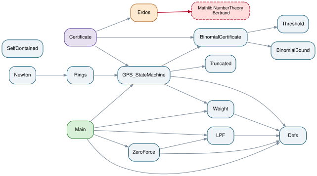

# StructuralSieve: Lean 4 formalization

Machine-checked formalization accompanying the paper
**"The Structural Sieve"** (A. Flamandzki).

**Status: fully verified, zero `sorry`, no extra axioms beyond Mathlib.**
The entire chain, from the definition of the complete generative base (Def. 2.1)
to `bertrand_chebyshev`, is machine-checked. Two results head this development,
in the order that actually motivated it. `StructuralSieve.prime_iff_uncovered_by_prev`
gives an exact structural equivalence on the window `(P_k, 2·P_k]`, not an
existence bound. `StructuralSieve.window_reach_self_contained` explains why the
window's reach is `m·P` (`2·P_max` for the standard base, or `P_min·P_max` for a
base whose minimum element is any `P_min ≤ P_max`) through self-containment.
`StructuralSieve.bertrand_chebyshev` falls out as a corollary of the sieve
mechanism these two describe together, not of either one by name (see *Origin
of the result* below). Its existence step is closed by a self-contained
central-binomial certificate (`binomial_contradiction`, `BinomialCertificate.lean`);
`Mathlib.NumberTheory.Bertrand` plays no role in that closure. The one file
that does import it, `Erdos.lean`, is an off-path alternative kept only for a
modularity comparison — see *Non-circularity* for the technical account.

## Origin of the result

The starting observation was not Bertrand's. Bertrand (1845) conjectured, from
tables, that every window `(n, 2n]` contains a prime, an *existence* question.
This project started from a different question about the same window: is every
composite in `(P_k, 2·P_k]` already covered by a prime strictly below `P_k` (or
by `2`)? Put differently, does the window need any prime factor from outside
itself at all? That is the question the development answers first, with an exact
equivalence rather than an existence bound:

> `StructuralSieve.prime_iff_uncovered_by_prev`, for `n ∈ (P_k, 2·P_k]`: `n` is
> prime **iff** `n` is not covered by the base of primes below `P_k`.

This is proved from pure divisibility: `ZeroForce.lean`'s Zero Effective Force
lemma shows the only multiple of `P_k` in its own window is `2·P_k`, already
covered by `2`, so `P_k` contributes zero new coverage to its own window; combined
with the least-prime-factor bound (`LPF.lean`), this gives the equivalence with no
appeal to counting or to the central binomial coefficient.

**Why the window's reach is exactly `2·P_max` (and, generally, `m·P`).**
The window `(P_max, 2·P_max]` is where the equivalence above lives, and the
constant `2` is not a choice:

> `StructuralSieve.window_reach_self_contained`, for a base whose minimum
> element is `m`, the least proper multiple of any new window element
> `q ∈ (P, hi]` built from that minimum is `m·q`; whenever the window's upper
> bound satisfies `hi ≤ m·P`, that multiple always falls strictly outside the
> window.

This is self-containment: at `m = 2` (the standard base, starting at the prime
`2`) it is exactly why the reach is `2·P_max` and not some larger multiplier:
a wider window would let a new element's own least multiple fall back inside it,
breaking the arithmetic (concretely: base `{2,3,5}`, a hypothetical window
`(5,15]` would contain both the new prime `7` and its own zero-force boundary
multiple `14 = 2·7` at once). The same argument fixes the reach `P_min·P_max`
for a base whose minimum element is any other prime `P_min ≤ P_max`
(`SelfContained.lean`'s `window_self_contained_bound_general` and
`max_self_contained_bound_general`, which specialize to the `m = 2` lemmas
`window_self_contained_bound`/`max_self_contained_width`). This is a fact about
the window's *size*, the container, rather than about whether it contains a
prime, the content; it is independent of the void/prime equivalence above, and
that equivalence never calls on it.

**Why an elementary proof is a strength here, not a limitation.**
`window_self_contained_bound_general` and `self_contained_bound_independent_of_gap`
answer a question about the sieve's own generative process: does a deterministic
sieving regime have an exact boundary, fixed only by the base's own extreme
values, independent of how irregular the gaps between primes happen to be? No
prior result answers this — not because it is hard and unattempted, but because
the question itself, in this exact form, is not one the existence-flavored
literature on prime gaps and windows asks. Determinism of a generative process
and existence of an object inside a range are different questions; this
development is about the first, and about it alone.

That the proof of this determinism claim needs nothing beyond `omega`, `ring`,
and `Nat.mul_le_mul` is not a caveat on its value — it is the source of its
value. A determinism claim resting on deep analytic machinery would be only as
certain as the weakest estimate buried in that machinery, and an error found
years later in some inequality it depends on would retroactively undermine it.
A determinism claim resting on bare Peano arithmetic inherits no such risk: it
is checked by a decision procedure, not by trusting a long chain of estimates,
and it holds with exactly the same certainty as `2 + 2 = 4`. Minimality of the
assumptions a result needs is, in proof theory, a measure of that result's
logical strength, not a mark against its interest — the simpler and more
elementary the argument for a real structural fact, the better the result is
on every axis: certainty, checkability, portability, and resistance to being
undermined by some later-discovered gap elsewhere. The right question about
`window_self_contained_bound_general` is not how hard it was to prove, but
whether this exact, gap-independent boundary of the sieve's deterministic
regime had been identified and proved before — and it had not.

**A base-case note on `P_k = 2`.** At the smallest anchor, `P_min = P_max = 2`
is the same element: it enters the base not because it is sieved-safe from some
smaller prime (there is none below it), but because there is nothing smaller to
eliminate it: `1` is multiplicatively neutral, so `2` survives by default, not
by exclusion. The equivalence `prime_iff_uncovered_by_prev` (an *inclusive*
`n.minFac ≤ P_k` bound, `Defs.lean`) remains true at `P_k = 2`; only the
narrative reading "covered by the *preceding* base" needs this base-case
exception, since there is no preceding base at `P_k = 2` (`𝒫' = ∅`).

**Bertrand's postulate falls out as a corollary.** Once a window survivor is
known to be prime and the window's reach is fixed, only existence remains: the
window must not be *entirely* covered. That is a single quantitative fact —
the base never covers its own window completely — closed here by the central
binomial coefficient (§2 below), the same object Erdős used for his 1932 proof
of the same postulate. The two projects ask different questions — existence of
a prime in the window, versus how far the base's own deterministic reach
extends and why it stops exactly there — and simply arrive at the same
underlying quantitative fact to close them; that is not a concern to work
around, only an observation. The proof term goes through the sieve's own
survivor lemma (`GPS_StateMachine.lean`'s `prime_in_window`), not through
`prime_iff_uncovered_by_prev` by name — that equivalence is proved for its own
sake, separately. The governing quantity is the **local insufficiency of the
full base** over its own window `(P_max, 2P_max]`, the longest run of covered
positions there.

## What is proved, and by what means

The reduction chain (all sorry-free):

```
bertrand_chebyshev  ←  prime_in_window  ←  structural_sieve_survivor
                     ←  dense_sieve_survivor  ←  binomial_contradiction
```

### Module dependency graph



The graph (regenerate with `scripts/dependency_graph.py`, which also prints a
non-circularity audit) makes the import structure explicit. `Main` reaches the
quantitative kernel through `GPS_StateMachine → BinomialCertificate →
{BinomialBound, Threshold}`, the self-contained path. The only edge to
`Mathlib.NumberTheory.Bertrand` (red) comes from `Erdos.lean` (see *Extended
development* below), which is **not** in the import closure of `Main`, so the
main theorem does not depend on Mathlib's Bertrand theorem.

**1. The structural reduction (independent, this project).**
This is the same reduction that yields the two headline results of *Origin of
the result* above (`prime_iff_uncovered_by_prev`, `window_reach_self_contained`):
LPF bound, Zero Effective Force, structural weight `w ≥ 1`, self-containment
(*why `2·P_max`*), and the sparse regime closed unconditionally by a union bound
(`Truncated.lean`) are all exercised by `bertrand_chebyshev`'s proof term. No
structural closure of the existence atom in the general (dense) window was
found; the atom is closed on the central binomial coefficient below. (A
separate, off-path structural closure for small anchors `P_k ≤ 83` exists in
`Rings.lean` (see *Extended development*), but is not invoked by the proof
term: every `P_k` is actually closed by the oracle or the certificate in §2.)

**2. The quantitative certificate (self-contained, this project): the bounds the
proof term actually uses.**
For `n ≥ 512` two bounds on the central binomial coefficient `C(2n,n)` are
combined. The upper bound (`window_centralBinom_le`, `BinomialBound.lean`) says
that if the window is empty, every prime factor of `C(2n,n)` is `≤ 2n/3`, so
the product is at most `(2n)^√(2n) · 4^(2n/3)`; it is reproved in-project from
Legendre/Kummer and primorial primitives, importing only `Choose.Factorization`
and `Primorial`, **not** `Mathlib.NumberTheory.Bertrand`. The prime-free size
threshold `n · (2n)^√(2n) · 4^(2n/3) ≤ 4^n` (`threshold_inequality`,
`Threshold.lean`) is a generic convexity inequality, adapted from Mathlib's
analysis (not its Bertrand file). With the lower bound `4^n < n · C(2n,n)`
(`Nat.four_pow_lt_mul_centralBinom`) they give `4^n < 4^n`, a contradiction
(`binomial_contradiction`, `BinomialCertificate.lean`). Small windows
`2 < n < 512` are closed by a local computational oracle (`small_window_oracle`),
chunked into fixed-width ranges glued by an auxiliary lemma and discharged by
kernel-checked `decide`: no `native_decide` anywhere in this repository.

## Non-circularity

The main theorem `bertrand_chebyshev` closes the atom via the self-contained
`binomial_contradiction`; its import closure does **not** contain
`Mathlib.NumberTheory.Bertrand`. That file is imported only in `Erdos.lean`,
which supplies instance A (`erdos_certificate`) for the modularity comparison
and sits **off** the main path. The circularity audit is a grep over
**usages**, not imports:

```sh
grep -rn "sorry" StructuralSieve                      # no matches
grep -rn "Nat.bertrand[^_]\|exists_prime_lt" StructuralSieve
# matches only in comments/documentation; never applied in a proof
```

## Trust base

The main theorem's import closure discharges its finite facts with kernel-checked
`decide` only: the small-window oracle (`small_window_oracle`, `BinomialCertificate.lean`)
is split into fixed-width chunks glued by an auxiliary lemma, specifically so that it
stays within the kernel's `decide` (not `native_decide`). `native_decide`
(compiled evaluation) appears exactly once in the repository, in `Erdos.lean`'s
`small_window_prime` (the off-path instance A kept only for the modularity
comparison); it is not reachable from `Main` (see the module dependency graph
above). Auditors who reject `native_decide` outright can therefore ignore
`Erdos.lean` entirely and still have a fully `decide`-only path to
`bertrand_chebyshev`.

## Exact versions (required for reproduction)

| Component | Pin |
|---|---|
| Lean toolchain | `leanprover/lean4:v4.35.0-rc2` (file `lean-toolchain`) |
| Mathlib | tag `v4.35.0-rc2`, commit `065356127b1dc0016f66b7283ce0ce2c4055aa55` |

Transitive dependencies (from `lake-manifest.json`, manifest format `1.1.0`):

| Package | Commit |
|---|---|
| batteries | `495c008c3e3f4fb4256ff5582ddb3abf3198026f` |
| aesop | `f642a64c76df8ba9cb53dba3b919425a0c2aeaf1` |
| proofwidgets | `be3b2e63b1bbf496c478cef98b86972a37c1417d` |
| Qq | `b8f98e9087e02c8553945a2c5abf07cec8e798c3` |
| importGraph | `85b59af46828c029a9168f2f9c35119bd0721e6e` |
| LeanSearchClient | `c5d5b8fe6e5158def25cd28eb94e4141ad97c843` |
| plausible | `55c8532eb21ec9f6d565d51d96b8ca50bd1fbef3` |
| Cli | `4f10f47646cb7d5748d6f423f4a07f98f7bbcc9e` |

The pinned commits are recorded in `lake-manifest.json`; keep that file under
version control so the exact dependency graph is reproducible.

## Build

The toolchain is selected automatically by `elan` from `lean-toolchain`.

```sh
lake exe cache get      # download prebuilt Mathlib oleans for the pinned commit
lake build              # build the StructuralSieve library
```

`lake exe cache get` is essential: without it, `lake build` would attempt to
compile all of Mathlib from source. A successful `lake build` reports **no
errors, no `sorry`, and no warnings in project files** (doc-string lint notices
replayed from Mathlib's own files are expected and harmless).

## File map

| File | Content (paper reference) |
|---|---|
| `StructuralSieve/Defs.lean` | Complete generative prime base, sieve coverage, window (Def. 2.1, Prop. 2.2) |
| `StructuralSieve/LPF.lean` | Least Prime Factor bound; uncovered ⇒ prime (Lemma 3.1, Cor. 3.2) |
| `StructuralSieve/ZeroForce.lean` | Zero Effective Force; composites covered by preceding base; **`prime_iff_uncovered_by_prev`**: headline equivalence (Lemma 4.1, Cor. 4.2) |
| `StructuralSieve/Weight.lean` | Structural weight `w ≥ 1`; expansion capacity `M' < P·φ(M')` (Lemma 4.3, Cor. 4.5) |
| `StructuralSieve/SelfContained.lean` | Self-containment fixes the window reach; **`window_reach_self_contained`**: headline result (*why `2·P_max`*, generalized to `P_min·P_max`) |
| `StructuralSieve/Truncated.lean` | Sparse-regime positivity by union bound, unconditional |
| `StructuralSieve/BinomialBound.lean` | Upper bound `window_centralBinom_le`, reproved from Legendre/Kummer + primorial primitives (no Bertrand import) |
| `StructuralSieve/Threshold.lean` | Prime-free size inequality `threshold_inequality` (real convexity; adapted from Mathlib's analysis, not its Bertrand file) |
| `StructuralSieve/BinomialCertificate.lean` | **Self-contained kernel**: `binomial_contradiction`: two bounds on `C(2n,n)` + local chunked, kernel-checked `decide` oracle (`small_window_oracle`, no `native_decide`); imports no `Mathlib.NumberTheory.Bertrand` |
| `StructuralSieve/GPS_StateMachine.lean` | Generative window; regime dispatch; `dense_sieve_survivor` (routes to `binomial_contradiction`); `prime_in_window` |
| `StructuralSieve/Main.lean` | Theorem 5.1 and `bertrand_chebyshev` |

### Extended development (verified, off the Palomar excerpt's path)

The four files below are fully verified, zero `sorry`, same trust base as
the rest of this repository, but are separate, self-standing results, not
exercised by `bertrand_chebyshev`'s own proof term, and not part of the narrow
`Challenge.lean`/`Solution.lean` excerpt reviewed by Palomar. They are kept
because they are genuine mathematics from the same research program,
described in full in the accompanying paper, not because Palomar's review
found them individually novel enough as a standalone submission item.

| File | Content (paper reference) |
|---|---|
| `StructuralSieve/Rings.lean` | Ring collective: void/coverage dichotomy generalized to the full deterministic zone `(P_k, P_k²)` (`void_iff_prime_in_deterministic_zone`), with `determinism_breaks_above` proving that reach exact; minFac telescope, interference (Legendre) identity, generalized family `(P_max, P_min·P_max]`; off-path small-anchor closures `P_k ≤ 83`; S1 bridge to `C(2n,n)` |
| `StructuralSieve/Newton.lean` | Off-path: a second, unused derivation of the central binomial coefficient's window content: S1 divisibility, lower bound `4^n ≤ (2n+1)·C(2n,n)` from the Pascal row |
| `StructuralSieve/Certificate.lean` | Modular interface `WindowCertificate`; instances `erdos_certificate` (via Mathlib) and `binomial_certificate` (self-contained): modularity as a theorem |
| `StructuralSieve/Erdos.lean` | Instance A (off the main path): `erdos_contradiction` via Mathlib's two `C(2n,n)` inequalities; kept only for the modularity comparison |

## License

This repository is licensed under the **Apache License, Version 2.0**; see
[`LICENSE`](LICENSE). The project depends on and adapts Mathlib (Apache-2.0), so its
licensing is Apache-2.0-compatible throughout. In particular `StructuralSieve/Threshold.lean` adapts a prime-free
size inequality from Mathlib (authors Patrick Stevens and Bolton Bailey); the attribution is
recorded in [`NOTICE`](NOTICE). All other files are original to this development and depend on
Mathlib only as a library.

## Citation

Cite the accompanying paper (see [`CITATION.cff`](CITATION.cff)). The formalization makes
the logical status of the result unambiguous: the structural reduction is machine-verified
and independent; the quantitative kernel is closed by a self-contained argument on the
central binomial coefficient (`binomial_contradiction`), with no dependence anywhere in
the project on Mathlib's own proof of Bertrand's postulate.
